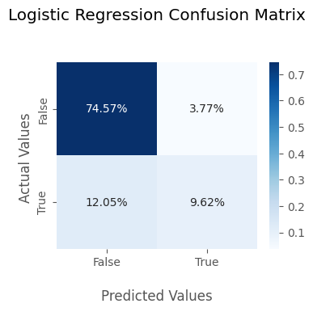
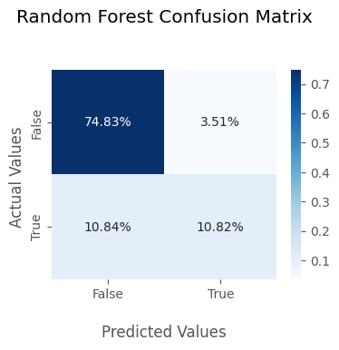
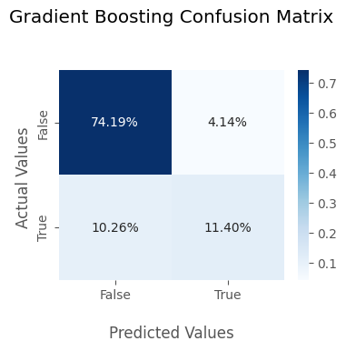
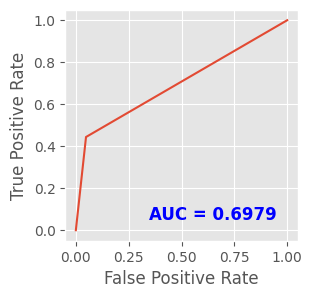
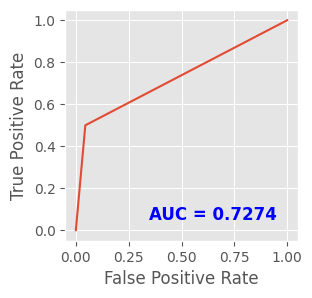
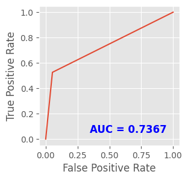

```python
import numpy as np
import pandas as pd

# import libraries for plotting
import matplotlib.pyplot as plt
import matplotlib.style as style
style.use('ggplot')
import seaborn as sns

from sklearn.preprocessing import LabelEncoder
from sklearn.preprocessing import OneHotEncoder

# hiding warnings
import warnings

warnings.filterwarnings('ignore')

from patsy import dmatrices
from statsmodels.stats.outliers_influence import variance_inflation_factor
from sklearn.model_selection import train_test_split
from sklearn.linear_model import LogisticRegression
from sklearn.preprocessing import LabelEncoder

# models
from sklearn.tree import DecisionTreeClassifier
from sklearn.ensemble import RandomForestClassifier
from sklearn.ensemble import GradientBoostingClassifier
from xgboost import XGBClassifier

from sklearn.metrics import accuracy_score,confusion_matrix,classification_report,f1_score,roc_curve, roc_auc_score

def plot_roc(preds):
    plt.figure(figsize=(3, 3), dpi=100)
    fpr, tpr, thresholds = roc_curve(y_test, preds)
    plt.plot(fpr, tpr)
    plt.text(0.95, 0.05, 'AUC = %0.4f' % roc_auc_score(y_test, preds), ha='right', fontsize=12, weight='bold', color='blue')
    plt.xlabel('False Positive Rate')
    plt.ylabel('True Positive Rate')
    
def plot_CF(matrix,model):
    plt.figure(figsize=(4,3))
    ax = sns.heatmap(matrix/np.sum(matrix),fmt='.2%', annot=True, cmap='Blues')

    ax.set_title('{} Confusion Matrix\n\n'.format(model));
    ax.set_xlabel('\nPredicted Values')
    ax.set_ylabel('Actual Values ');

    ## Ticket labels - List must be in alphabetical order
    ax.xaxis.set_ticklabels(['False','True'])
    ax.yaxis.set_ticklabels(['False','True'])

    ## Display the visualization of the Confusion Matrix.
    plt.show()
```


```python
# importing dataset
data = './weatherAUS.csv'

df = pd.read_csv(data)

df.shape
```


    (145460, 23)


```python
cats = [var for var in df.columns if df[var].dtype=='O']
print('Number of variables: ',len(cats))
print('Variables :', cats)
```

    Number of variables:  7
    Variables : ['Date', 'Location', 'WindGustDir', 'WindDir9am', 'WindDir3pm', 'RainToday', 'RainTomorrow']
    


```python
for col in cats:
    if col != 'Location' and col != 'Date':
        df[col] = df[col].replace(np.nan,df[col].mode()[0])
```


```python
num_cols = []
for col in df:
    if df[col].dtype == 'float64':
        num_cols.append(col)
```


```python
# After checking the normalization
# Replacing NaN values to Mean of respective column
for col in num_cols:
    if col == 'Rainfall':
        df[col] = df[col].replace(np.nan, df[col].median())
    else:
        df[col] = df[col].replace(np.nan, df[col].mean())
```


```python
for index,row in df.iterrows():
    if df['Rainfall'][index] > 0:
        df['RainToday'][index] = 'Yes'
```


```python
Labeler = LabelEncoder()
df['RainToday'] = Labeler.fit_transform(df['RainToday'])
df['RainTomorrow'] = Labeler.fit_transform(df['RainTomorrow'])
```


```python
X = df.drop(['RainTomorrow','Date','Location'],axis=1)
y= df[['RainTomorrow']]
```


```python
X.drop(['WindGustDir','WindDir9am','WindDir3pm'],axis=1,inplace=True)
```


```python
maxaccu=0
maxRS=0

for i in range(0,200):
    X_train,X_test,y_train,y_test= train_test_split(X,y,random_state=i,test_size=.30)
    LR= LogisticRegression()
    LR.fit(X_train,y_train)
    pred= LR.predict(X_test)
    acc=accuracy_score(y_test,pred)
    if acc>maxaccu:
        maxaccu=acc
        maxRS=i
print("Best accuracy is ",maxaccu,"on Random State =",maxRS)

DT_model= DecisionTreeClassifier(random_state=maxRS)
RFR_model= RandomForestClassifier(random_state=maxRS)
XGB_model= XGBClassifier(random_state=maxRS)
LR = LogisticRegression(random_state=maxRS)
GB_model= GradientBoostingClassifier(random_state=maxRS)
models = [LR,DT_model, RFR_model, XGB_model, GB_model]

accuracy=[]
predicts=[]
f1s=[]
for m in models:
    m.fit(X_train,y_train)
    m.score(X_train,y_train)
    pred= m.predict(X_test)
    f1s.append(f1_score(y_test,pred))
    predicts.append(pred)
    accuracy.append(round(accuracy_score(y_test,pred) * 100, 2))
    print('Model:',m,' Accuracy:',accuracy)

pd.DataFrame({'Model':models,'Accuracy':accuracy,'F1 Score':f1s})
```

    Best accuracy is  0.8445162473073926 on Random State = 166
    Model: LogisticRegression(random_state=166)  Accuracy: [84.19]
    Model: DecisionTreeClassifier(random_state=166)  Accuracy: [84.19, 78.54]
    Model: RandomForestClassifier(random_state=166)  Accuracy: [84.19, 78.54, 85.65]
    Model: XGBClassifier(base_score=0.5, booster='gbtree', callbacks=None,
                  colsample_bylevel=1, colsample_bynode=1, colsample_bytree=1,
                  early_stopping_rounds=None, enable_categorical=False,
                  eval_metric=None, gamma=0, gpu_id=-1, grow_policy='depthwise',
                  importance_type=None, interaction_constraints='',
                  learning_rate=0.300000012, max_bin=256, max_cat_to_onehot=4,
                  max_delta_step=0, max_depth=6, max_leaves=0, min_child_weight=1,
                  missing=nan, monotone_constraints='()', n_estimators=100,
                  n_jobs=0, num_parallel_tree=1, predictor='auto', random_state=166,
                  reg_alpha=0, reg_lambda=1, ...)  Accuracy: [84.19, 78.54, 85.65, 85.6]
    Model: GradientBoostingClassifier(random_state=166)  Accuracy: [84.19, 78.54, 85.65, 85.6, 85.03]
    


<div>
<style scoped>
    .dataframe tbody tr th:only-of-type {
        vertical-align: middle;
    }

    .dataframe tbody tr th {
        vertical-align: top;
    }

    .dataframe thead th {
        text-align: right;
    }
</style>
<table border="1" class="dataframe">
  <thead>
    <tr style="text-align: right;">
      <th></th>
      <th>Model</th>
      <th>Accuracy</th>
      <th>F1 Score</th>
    </tr>
  </thead>
  <tbody>
    <tr>
      <th>0</th>
      <td>LogisticRegression(random_state=166)</td>
      <td>84.19</td>
      <td>0.548748</td>
    </tr>
    <tr>
      <th>1</th>
      <td>DecisionTreeClassifier(random_state=166)</td>
      <td>78.54</td>
      <td>0.514312</td>
    </tr>
    <tr>
      <th>2</th>
      <td>(DecisionTreeClassifier(max_features='sqrt', r...</td>
      <td>85.65</td>
      <td>0.601350</td>
    </tr>
    <tr>
      <th>3</th>
      <td>XGBClassifier(base_score=0.5, booster='gbtree'...</td>
      <td>85.60</td>
      <td>0.612836</td>
    </tr>
    <tr>
      <th>4</th>
      <td>([DecisionTreeRegressor(criterion='friedman_ms...</td>
      <td>85.03</td>
      <td>0.585322</td>
    </tr>
  </tbody>
</table>
</div>


```python
models.pop(1)
models.pop(3)
models = ['Logistic Regression','Random Forest','Gradient Boosting']
accuracy.pop(1)
accuracy.pop(3)
f1s.pop(1)
f1s.pop(3)
pd.DataFrame({'Model':models,'Accuracy':accuracy,'F1 Score':f1s})
```


<div>
<style scoped>
    .dataframe tbody tr th:only-of-type {
        vertical-align: middle;
    }

    .dataframe tbody tr th {
        vertical-align: top;
    }

    .dataframe thead th {
        text-align: right;
    }
</style>
<table border="1" class="dataframe">
  <thead>
    <tr style="text-align: right;">
      <th></th>
      <th>Model</th>
      <th>Accuracy</th>
      <th>F1 Score</th>
    </tr>
  </thead>
  <tbody>
    <tr>
      <th>0</th>
      <td>Logistic Regression</td>
      <td>84.19</td>
      <td>0.548748</td>
    </tr>
    <tr>
      <th>1</th>
      <td>Random Forest</td>
      <td>85.65</td>
      <td>0.601350</td>
    </tr>
    <tr>
      <th>2</th>
      <td>Gradient Boosting</td>
      <td>85.60</td>
      <td>0.612836</td>
    </tr>
  </tbody>
</table>
</div>


```python
predicts.pop(1)
predicts.pop(3)
```


    array([0, 0, 0, ..., 0, 0, 1])


# PEFORMANCE/VALIDATION

### LOGISTIC REGRESSION


```python
print(classification_report(y_test,predicts[0]))
```

                  precision    recall  f1-score   support
    
               0       0.86      0.95      0.90     34185
               1       0.72      0.44      0.55      9453
    
        accuracy                           0.84     43638
       macro avg       0.79      0.70      0.73     43638
    weighted avg       0.83      0.84      0.83     43638
    
    


```python
plot_CF(confusion_matrix(y_test,predicts[0]),models[0])
```


    

    


### RANDOM FOREST


```python
print(classification_report(y_test,predicts[1]))
```

                  precision    recall  f1-score   support
    
               0       0.87      0.96      0.91     34185
               1       0.76      0.50      0.60      9453
    
        accuracy                           0.86     43638
       macro avg       0.81      0.73      0.76     43638
    weighted avg       0.85      0.86      0.85     43638
    
    


```python
plot_CF(confusion_matrix(y_test,predicts[1]),models[1])
```


    

    


### GRADIENT BOOSTING


```python
print(classification_report(y_test,predicts[2]))
```

                  precision    recall  f1-score   support
    
               0       0.88      0.95      0.91     34185
               1       0.73      0.53      0.61      9453
    
        accuracy                           0.86     43638
       macro avg       0.81      0.74      0.76     43638
    weighted avg       0.85      0.86      0.85     43638
    
    


```python
plot_CF(confusion_matrix(y_test,predicts[2]),models[2])
```


    

    


```python
plot_roc(predicts[0])
```


    

    


```python
plot_roc(predicts[1])
```


    

    


```python
plot_roc(predicts[2])
```


    

    


```python

```


```python

```
