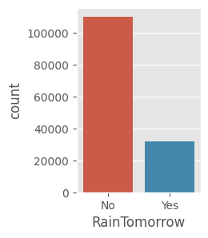
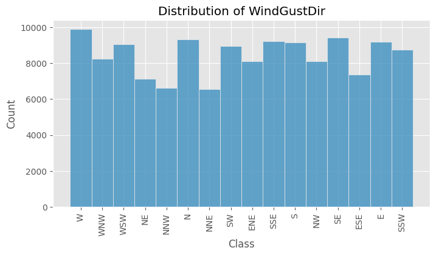
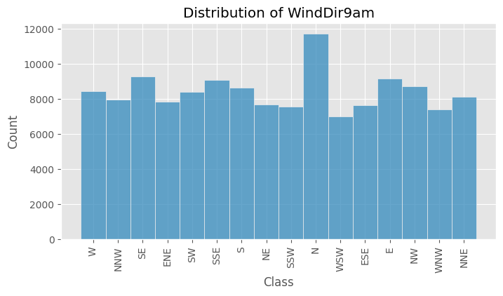
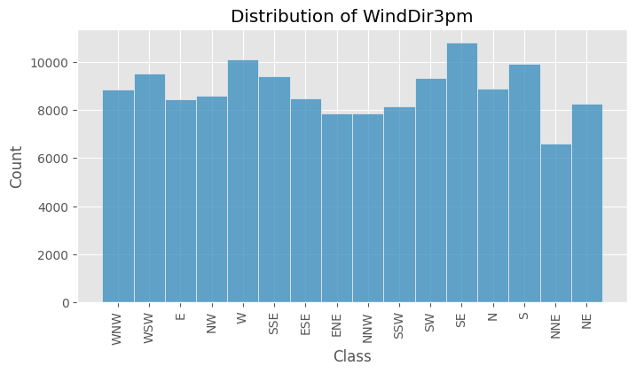
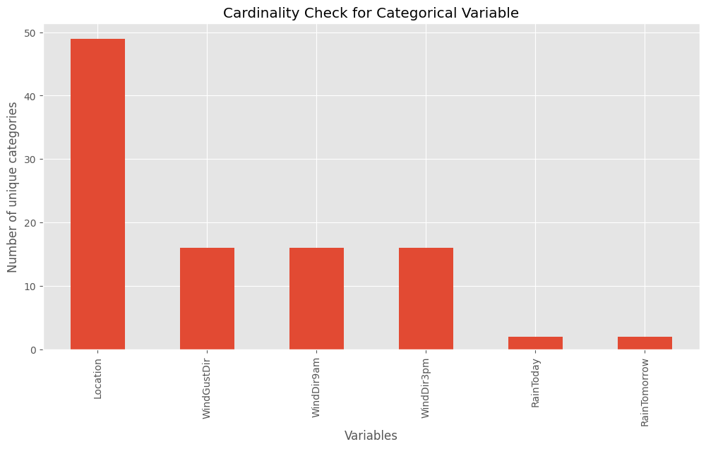
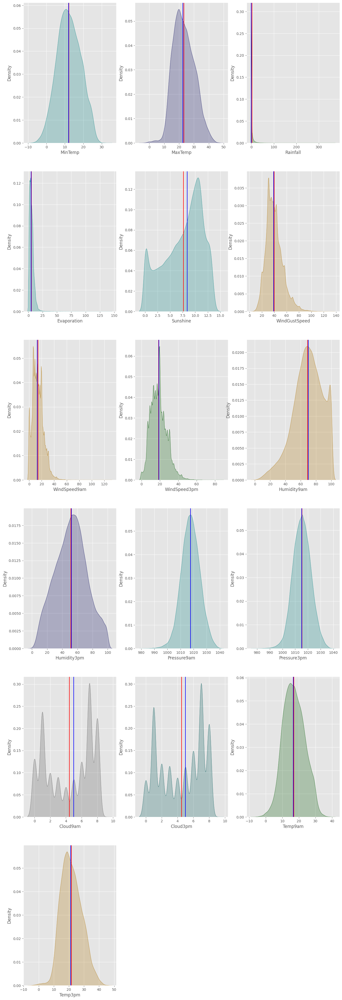
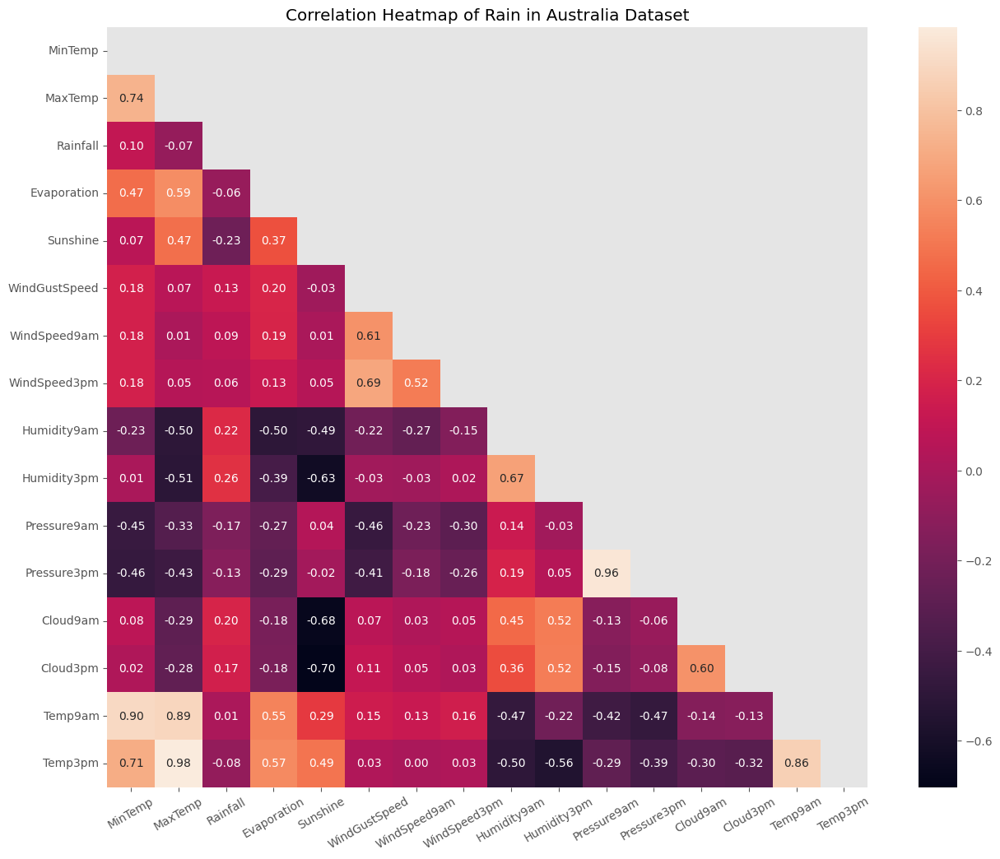

# Rain Forecasting for Australia

### Data set from [Kaggle](https://www.kaggle.com/datasets/jsphyg/weather-dataset-rattle-package)


```python
import numpy as np
import pandas as pd

# import libraries for plotting
import matplotlib.pyplot as plt
import matplotlib.style as style
style.use('ggplot')
import seaborn as sns

from sklearn.preprocessing import LabelEncoder
from sklearn.preprocessing import OneHotEncoder

# hiding warnings
import warnings

warnings.filterwarnings('ignore')
```


```python
# importing dataset
data = './weatherAUS.csv'

df = pd.read_csv(data)
```

# EDA


```python
df.shape
```


    (145460, 23)


```python
df.head(25)
```


<div>
<style scoped>
    .dataframe tbody tr th:only-of-type {
        vertical-align: middle;
    }

    .dataframe tbody tr th {
        vertical-align: top;
    }

    .dataframe thead th {
        text-align: right;
    }
</style>
<table border="1" class="dataframe">
  <thead>
    <tr style="text-align: right;">
      <th></th>
      <th>Date</th>
      <th>Location</th>
      <th>MinTemp</th>
      <th>MaxTemp</th>
      <th>Rainfall</th>
      <th>Evaporation</th>
      <th>Sunshine</th>
      <th>WindGustDir</th>
      <th>WindGustSpeed</th>
      <th>WindDir9am</th>
      <th>...</th>
      <th>Humidity9am</th>
      <th>Humidity3pm</th>
      <th>Pressure9am</th>
      <th>Pressure3pm</th>
      <th>Cloud9am</th>
      <th>Cloud3pm</th>
      <th>Temp9am</th>
      <th>Temp3pm</th>
      <th>RainToday</th>
      <th>RainTomorrow</th>
    </tr>
  </thead>
  <tbody>
    <tr>
      <th>0</th>
      <td>2008-12-01</td>
      <td>Albury</td>
      <td>13.4</td>
      <td>22.9</td>
      <td>0.6</td>
      <td>NaN</td>
      <td>NaN</td>
      <td>W</td>
      <td>44.0</td>
      <td>W</td>
      <td>...</td>
      <td>71.0</td>
      <td>22.0</td>
      <td>1007.7</td>
      <td>1007.1</td>
      <td>8.0</td>
      <td>NaN</td>
      <td>16.9</td>
      <td>21.8</td>
      <td>No</td>
      <td>No</td>
    </tr>
    <tr>
      <th>1</th>
      <td>2008-12-02</td>
      <td>Albury</td>
      <td>7.4</td>
      <td>25.1</td>
      <td>0.0</td>
      <td>NaN</td>
      <td>NaN</td>
      <td>WNW</td>
      <td>44.0</td>
      <td>NNW</td>
      <td>...</td>
      <td>44.0</td>
      <td>25.0</td>
      <td>1010.6</td>
      <td>1007.8</td>
      <td>NaN</td>
      <td>NaN</td>
      <td>17.2</td>
      <td>24.3</td>
      <td>No</td>
      <td>No</td>
    </tr>
    <tr>
      <th>2</th>
      <td>2008-12-03</td>
      <td>Albury</td>
      <td>12.9</td>
      <td>25.7</td>
      <td>0.0</td>
      <td>NaN</td>
      <td>NaN</td>
      <td>WSW</td>
      <td>46.0</td>
      <td>W</td>
      <td>...</td>
      <td>38.0</td>
      <td>30.0</td>
      <td>1007.6</td>
      <td>1008.7</td>
      <td>NaN</td>
      <td>2.0</td>
      <td>21.0</td>
      <td>23.2</td>
      <td>No</td>
      <td>No</td>
    </tr>
    <tr>
      <th>3</th>
      <td>2008-12-04</td>
      <td>Albury</td>
      <td>9.2</td>
      <td>28.0</td>
      <td>0.0</td>
      <td>NaN</td>
      <td>NaN</td>
      <td>NE</td>
      <td>24.0</td>
      <td>SE</td>
      <td>...</td>
      <td>45.0</td>
      <td>16.0</td>
      <td>1017.6</td>
      <td>1012.8</td>
      <td>NaN</td>
      <td>NaN</td>
      <td>18.1</td>
      <td>26.5</td>
      <td>No</td>
      <td>No</td>
    </tr>
    <tr>
      <th>4</th>
      <td>2008-12-05</td>
      <td>Albury</td>
      <td>17.5</td>
      <td>32.3</td>
      <td>1.0</td>
      <td>NaN</td>
      <td>NaN</td>
      <td>W</td>
      <td>41.0</td>
      <td>ENE</td>
      <td>...</td>
      <td>82.0</td>
      <td>33.0</td>
      <td>1010.8</td>
      <td>1006.0</td>
      <td>7.0</td>
      <td>8.0</td>
      <td>17.8</td>
      <td>29.7</td>
      <td>No</td>
      <td>No</td>
    </tr>
    <tr>
      <th>5</th>
      <td>2008-12-06</td>
      <td>Albury</td>
      <td>14.6</td>
      <td>29.7</td>
      <td>0.2</td>
      <td>NaN</td>
      <td>NaN</td>
      <td>WNW</td>
      <td>56.0</td>
      <td>W</td>
      <td>...</td>
      <td>55.0</td>
      <td>23.0</td>
      <td>1009.2</td>
      <td>1005.4</td>
      <td>NaN</td>
      <td>NaN</td>
      <td>20.6</td>
      <td>28.9</td>
      <td>No</td>
      <td>No</td>
    </tr>
    <tr>
      <th>6</th>
      <td>2008-12-07</td>
      <td>Albury</td>
      <td>14.3</td>
      <td>25.0</td>
      <td>0.0</td>
      <td>NaN</td>
      <td>NaN</td>
      <td>W</td>
      <td>50.0</td>
      <td>SW</td>
      <td>...</td>
      <td>49.0</td>
      <td>19.0</td>
      <td>1009.6</td>
      <td>1008.2</td>
      <td>1.0</td>
      <td>NaN</td>
      <td>18.1</td>
      <td>24.6</td>
      <td>No</td>
      <td>No</td>
    </tr>
    <tr>
      <th>7</th>
      <td>2008-12-08</td>
      <td>Albury</td>
      <td>7.7</td>
      <td>26.7</td>
      <td>0.0</td>
      <td>NaN</td>
      <td>NaN</td>
      <td>W</td>
      <td>35.0</td>
      <td>SSE</td>
      <td>...</td>
      <td>48.0</td>
      <td>19.0</td>
      <td>1013.4</td>
      <td>1010.1</td>
      <td>NaN</td>
      <td>NaN</td>
      <td>16.3</td>
      <td>25.5</td>
      <td>No</td>
      <td>No</td>
    </tr>
    <tr>
      <th>8</th>
      <td>2008-12-09</td>
      <td>Albury</td>
      <td>9.7</td>
      <td>31.9</td>
      <td>0.0</td>
      <td>NaN</td>
      <td>NaN</td>
      <td>NNW</td>
      <td>80.0</td>
      <td>SE</td>
      <td>...</td>
      <td>42.0</td>
      <td>9.0</td>
      <td>1008.9</td>
      <td>1003.6</td>
      <td>NaN</td>
      <td>NaN</td>
      <td>18.3</td>
      <td>30.2</td>
      <td>No</td>
      <td>Yes</td>
    </tr>
    <tr>
      <th>9</th>
      <td>2008-12-10</td>
      <td>Albury</td>
      <td>13.1</td>
      <td>30.1</td>
      <td>1.4</td>
      <td>NaN</td>
      <td>NaN</td>
      <td>W</td>
      <td>28.0</td>
      <td>S</td>
      <td>...</td>
      <td>58.0</td>
      <td>27.0</td>
      <td>1007.0</td>
      <td>1005.7</td>
      <td>NaN</td>
      <td>NaN</td>
      <td>20.1</td>
      <td>28.2</td>
      <td>Yes</td>
      <td>No</td>
    </tr>
    <tr>
      <th>10</th>
      <td>2008-12-11</td>
      <td>Albury</td>
      <td>13.4</td>
      <td>30.4</td>
      <td>0.0</td>
      <td>NaN</td>
      <td>NaN</td>
      <td>N</td>
      <td>30.0</td>
      <td>SSE</td>
      <td>...</td>
      <td>48.0</td>
      <td>22.0</td>
      <td>1011.8</td>
      <td>1008.7</td>
      <td>NaN</td>
      <td>NaN</td>
      <td>20.4</td>
      <td>28.8</td>
      <td>No</td>
      <td>Yes</td>
    </tr>
    <tr>
      <th>11</th>
      <td>2008-12-12</td>
      <td>Albury</td>
      <td>15.9</td>
      <td>21.7</td>
      <td>2.2</td>
      <td>NaN</td>
      <td>NaN</td>
      <td>NNE</td>
      <td>31.0</td>
      <td>NE</td>
      <td>...</td>
      <td>89.0</td>
      <td>91.0</td>
      <td>1010.5</td>
      <td>1004.2</td>
      <td>8.0</td>
      <td>8.0</td>
      <td>15.9</td>
      <td>17.0</td>
      <td>Yes</td>
      <td>Yes</td>
    </tr>
    <tr>
      <th>12</th>
      <td>2008-12-13</td>
      <td>Albury</td>
      <td>15.9</td>
      <td>18.6</td>
      <td>15.6</td>
      <td>NaN</td>
      <td>NaN</td>
      <td>W</td>
      <td>61.0</td>
      <td>NNW</td>
      <td>...</td>
      <td>76.0</td>
      <td>93.0</td>
      <td>994.3</td>
      <td>993.0</td>
      <td>8.0</td>
      <td>8.0</td>
      <td>17.4</td>
      <td>15.8</td>
      <td>Yes</td>
      <td>Yes</td>
    </tr>
    <tr>
      <th>13</th>
      <td>2008-12-14</td>
      <td>Albury</td>
      <td>12.6</td>
      <td>21.0</td>
      <td>3.6</td>
      <td>NaN</td>
      <td>NaN</td>
      <td>SW</td>
      <td>44.0</td>
      <td>W</td>
      <td>...</td>
      <td>65.0</td>
      <td>43.0</td>
      <td>1001.2</td>
      <td>1001.8</td>
      <td>NaN</td>
      <td>7.0</td>
      <td>15.8</td>
      <td>19.8</td>
      <td>Yes</td>
      <td>No</td>
    </tr>
    <tr>
      <th>14</th>
      <td>2008-12-15</td>
      <td>Albury</td>
      <td>8.4</td>
      <td>24.6</td>
      <td>0.0</td>
      <td>NaN</td>
      <td>NaN</td>
      <td>NaN</td>
      <td>NaN</td>
      <td>S</td>
      <td>...</td>
      <td>57.0</td>
      <td>32.0</td>
      <td>1009.7</td>
      <td>1008.7</td>
      <td>NaN</td>
      <td>NaN</td>
      <td>15.9</td>
      <td>23.5</td>
      <td>No</td>
      <td>NaN</td>
    </tr>
    <tr>
      <th>15</th>
      <td>2008-12-16</td>
      <td>Albury</td>
      <td>9.8</td>
      <td>27.7</td>
      <td>NaN</td>
      <td>NaN</td>
      <td>NaN</td>
      <td>WNW</td>
      <td>50.0</td>
      <td>NaN</td>
      <td>...</td>
      <td>50.0</td>
      <td>28.0</td>
      <td>1013.4</td>
      <td>1010.3</td>
      <td>0.0</td>
      <td>NaN</td>
      <td>17.3</td>
      <td>26.2</td>
      <td>NaN</td>
      <td>No</td>
    </tr>
    <tr>
      <th>16</th>
      <td>2008-12-17</td>
      <td>Albury</td>
      <td>14.1</td>
      <td>20.9</td>
      <td>0.0</td>
      <td>NaN</td>
      <td>NaN</td>
      <td>ENE</td>
      <td>22.0</td>
      <td>SSW</td>
      <td>...</td>
      <td>69.0</td>
      <td>82.0</td>
      <td>1012.2</td>
      <td>1010.4</td>
      <td>8.0</td>
      <td>1.0</td>
      <td>17.2</td>
      <td>18.1</td>
      <td>No</td>
      <td>Yes</td>
    </tr>
    <tr>
      <th>17</th>
      <td>2008-12-18</td>
      <td>Albury</td>
      <td>13.5</td>
      <td>22.9</td>
      <td>16.8</td>
      <td>NaN</td>
      <td>NaN</td>
      <td>W</td>
      <td>63.0</td>
      <td>N</td>
      <td>...</td>
      <td>80.0</td>
      <td>65.0</td>
      <td>1005.8</td>
      <td>1002.2</td>
      <td>8.0</td>
      <td>1.0</td>
      <td>18.0</td>
      <td>21.5</td>
      <td>Yes</td>
      <td>Yes</td>
    </tr>
    <tr>
      <th>18</th>
      <td>2008-12-19</td>
      <td>Albury</td>
      <td>11.2</td>
      <td>22.5</td>
      <td>10.6</td>
      <td>NaN</td>
      <td>NaN</td>
      <td>SSE</td>
      <td>43.0</td>
      <td>WSW</td>
      <td>...</td>
      <td>47.0</td>
      <td>32.0</td>
      <td>1009.4</td>
      <td>1009.7</td>
      <td>NaN</td>
      <td>2.0</td>
      <td>15.5</td>
      <td>21.0</td>
      <td>Yes</td>
      <td>No</td>
    </tr>
    <tr>
      <th>19</th>
      <td>2008-12-20</td>
      <td>Albury</td>
      <td>9.8</td>
      <td>25.6</td>
      <td>0.0</td>
      <td>NaN</td>
      <td>NaN</td>
      <td>SSE</td>
      <td>26.0</td>
      <td>SE</td>
      <td>...</td>
      <td>45.0</td>
      <td>26.0</td>
      <td>1019.2</td>
      <td>1017.1</td>
      <td>NaN</td>
      <td>NaN</td>
      <td>15.8</td>
      <td>23.2</td>
      <td>No</td>
      <td>No</td>
    </tr>
    <tr>
      <th>20</th>
      <td>2008-12-21</td>
      <td>Albury</td>
      <td>11.5</td>
      <td>29.3</td>
      <td>0.0</td>
      <td>NaN</td>
      <td>NaN</td>
      <td>S</td>
      <td>24.0</td>
      <td>SE</td>
      <td>...</td>
      <td>56.0</td>
      <td>28.0</td>
      <td>1019.3</td>
      <td>1014.8</td>
      <td>NaN</td>
      <td>NaN</td>
      <td>19.1</td>
      <td>27.3</td>
      <td>No</td>
      <td>No</td>
    </tr>
    <tr>
      <th>21</th>
      <td>2008-12-22</td>
      <td>Albury</td>
      <td>17.1</td>
      <td>33.0</td>
      <td>0.0</td>
      <td>NaN</td>
      <td>NaN</td>
      <td>NE</td>
      <td>43.0</td>
      <td>NE</td>
      <td>...</td>
      <td>38.0</td>
      <td>28.0</td>
      <td>1013.6</td>
      <td>1008.1</td>
      <td>NaN</td>
      <td>1.0</td>
      <td>24.5</td>
      <td>31.6</td>
      <td>No</td>
      <td>No</td>
    </tr>
    <tr>
      <th>22</th>
      <td>2008-12-23</td>
      <td>Albury</td>
      <td>20.5</td>
      <td>31.8</td>
      <td>0.0</td>
      <td>NaN</td>
      <td>NaN</td>
      <td>WNW</td>
      <td>41.0</td>
      <td>W</td>
      <td>...</td>
      <td>54.0</td>
      <td>24.0</td>
      <td>1007.8</td>
      <td>1005.7</td>
      <td>NaN</td>
      <td>NaN</td>
      <td>23.8</td>
      <td>30.8</td>
      <td>No</td>
      <td>No</td>
    </tr>
    <tr>
      <th>23</th>
      <td>2008-12-24</td>
      <td>Albury</td>
      <td>15.3</td>
      <td>30.9</td>
      <td>0.0</td>
      <td>NaN</td>
      <td>NaN</td>
      <td>N</td>
      <td>33.0</td>
      <td>ESE</td>
      <td>...</td>
      <td>55.0</td>
      <td>23.0</td>
      <td>1011.0</td>
      <td>1008.2</td>
      <td>5.0</td>
      <td>NaN</td>
      <td>20.9</td>
      <td>29.0</td>
      <td>No</td>
      <td>No</td>
    </tr>
    <tr>
      <th>24</th>
      <td>2008-12-25</td>
      <td>Albury</td>
      <td>12.6</td>
      <td>32.4</td>
      <td>0.0</td>
      <td>NaN</td>
      <td>NaN</td>
      <td>W</td>
      <td>43.0</td>
      <td>E</td>
      <td>...</td>
      <td>49.0</td>
      <td>17.0</td>
      <td>1012.9</td>
      <td>1010.1</td>
      <td>NaN</td>
      <td>NaN</td>
      <td>21.5</td>
      <td>31.2</td>
      <td>No</td>
      <td>No</td>
    </tr>
  </tbody>
</table>
<p>25 rows × 23 columns</p>
</div>


```python
col_names = df.columns

col_names
```


    Index(['Date', 'Location', 'MinTemp', 'MaxTemp', 'Rainfall', 'Evaporation',
           'Sunshine', 'WindGustDir', 'WindGustSpeed', 'WindDir9am', 'WindDir3pm',
           'WindSpeed9am', 'WindSpeed3pm', 'Humidity9am', 'Humidity3pm',
           'Pressure9am', 'Pressure3pm', 'Cloud9am', 'Cloud3pm', 'Temp9am',
           'Temp3pm', 'RainToday', 'RainTomorrow'],
          dtype='object')


```python
df.info()
```

    <class 'pandas.core.frame.DataFrame'>
    RangeIndex: 145460 entries, 0 to 145459
    Data columns (total 23 columns):
     #   Column         Non-Null Count   Dtype  
    ---  ------         --------------   -----  
     0   Date           145460 non-null  object 
     1   Location       145460 non-null  object 
     2   MinTemp        143975 non-null  float64
     3   MaxTemp        144199 non-null  float64
     4   Rainfall       142199 non-null  float64
     5   Evaporation    82670 non-null   float64
     6   Sunshine       75625 non-null   float64
     7   WindGustDir    135134 non-null  object 
     8   WindGustSpeed  135197 non-null  float64
     9   WindDir9am     134894 non-null  object 
     10  WindDir3pm     141232 non-null  object 
     11  WindSpeed9am   143693 non-null  float64
     12  WindSpeed3pm   142398 non-null  float64
     13  Humidity9am    142806 non-null  float64
     14  Humidity3pm    140953 non-null  float64
     15  Pressure9am    130395 non-null  float64
     16  Pressure3pm    130432 non-null  float64
     17  Cloud9am       89572 non-null   float64
     18  Cloud3pm       86102 non-null   float64
     19  Temp9am        143693 non-null  float64
     20  Temp3pm        141851 non-null  float64
     21  RainToday      142199 non-null  object 
     22  RainTomorrow   142193 non-null  object 
    dtypes: float64(16), object(7)
    memory usage: 25.5+ MB
    


```python
# Null Values count
null_counts = round(df.isnull().sum()/len(df) * 100,2)
print('Percentages of Null values in Features :')
print(null_counts[null_counts > 0].sort_values(ascending=False))
```

    Percentages of Null values in Features :
    Sunshine         48.01
    Evaporation      43.17
    Cloud3pm         40.81
    Cloud9am         38.42
    Pressure9am      10.36
    Pressure3pm      10.33
    WindDir9am        7.26
    WindGustDir       7.10
    WindGustSpeed     7.06
    Humidity3pm       3.10
    WindDir3pm        2.91
    Temp3pm           2.48
    RainTomorrow      2.25
    Rainfall          2.24
    RainToday         2.24
    WindSpeed3pm      2.11
    Humidity9am       1.82
    Temp9am           1.21
    WindSpeed9am      1.21
    MinTemp           1.02
    MaxTemp           0.87
    dtype: float64
    


```python
print(round(df.describe()),2)
```

            MinTemp   MaxTemp  Rainfall  Evaporation  Sunshine  WindGustSpeed  \
    count  143975.0  144199.0  142199.0      82670.0   75625.0       135197.0   
    mean       12.0      23.0       2.0          5.0       8.0           40.0   
    std         6.0       7.0       8.0          4.0       4.0           14.0   
    min        -8.0      -5.0       0.0          0.0       0.0            6.0   
    25%         8.0      18.0       0.0          3.0       5.0           31.0   
    50%        12.0      23.0       0.0          5.0       8.0           39.0   
    75%        17.0      28.0       1.0          7.0      11.0           48.0   
    max        34.0      48.0     371.0        145.0      14.0          135.0   
    
           WindSpeed9am  WindSpeed3pm  Humidity9am  Humidity3pm  Pressure9am  \
    count      143693.0      142398.0     142806.0     140953.0     130395.0   
    mean           14.0          19.0         69.0         52.0       1018.0   
    std             9.0           9.0         19.0         21.0          7.0   
    min             0.0           0.0          0.0          0.0        980.0   
    25%             7.0          13.0         57.0         37.0       1013.0   
    50%            13.0          19.0         70.0         52.0       1018.0   
    75%            19.0          24.0         83.0         66.0       1022.0   
    max           130.0          87.0        100.0        100.0       1041.0   
    
           Pressure3pm  Cloud9am  Cloud3pm   Temp9am   Temp3pm  
    count     130432.0   89572.0   86102.0  143693.0  141851.0  
    mean        1015.0       4.0       5.0      17.0      22.0  
    std            7.0       3.0       3.0       6.0       7.0  
    min          977.0       0.0       0.0      -7.0      -5.0  
    25%         1010.0       1.0       2.0      12.0      17.0  
    50%         1015.0       5.0       5.0      17.0      21.0  
    75%         1020.0       7.0       7.0      22.0      26.0  
    max         1040.0       9.0       9.0      40.0      47.0   2
    

## Target variables
1) RainToday
2) RainTomorrow


```python
print('Unique: ',df['RainToday'].unique())
print('Nulls %: ',round(df['RainToday'].isnull().sum()/len(df)*100,3))
```

    Unique:  ['No' 'Yes' nan]
    Nulls %:  2.242
    


```python
print('Unique: ',df['RainTomorrow'].unique())
df['RainTomorrow'].value_counts(normalize=True,dropna=False)*100
```

    Unique:  ['No' 'Yes' nan]
    


    No     75.839406
    Yes    21.914616
    NaN     2.245978
    Name: RainTomorrow, dtype: float64


```python
f, ax = plt.subplots(figsize=(2, 3))
ax = sns.countplot(x="RainTomorrow", data=df)
plt.show()
```


    

    


## EDA of Categorical Variables


```python
cats = [var for var in df.columns if df[var].dtype=='O']
print('Number of variables: ',len(cats))
print('Variables :', cats)
```

    Number of variables:  7
    Variables : ['Date', 'Location', 'WindGustDir', 'WindDir9am', 'WindDir3pm', 'RainToday', 'RainTomorrow']
    


```python
df[cats].head(10)
```


<div>
<style scoped>
    .dataframe tbody tr th:only-of-type {
        vertical-align: middle;
    }

    .dataframe tbody tr th {
        vertical-align: top;
    }

    .dataframe thead th {
        text-align: right;
    }
</style>
<table border="1" class="dataframe">
  <thead>
    <tr style="text-align: right;">
      <th></th>
      <th>Date</th>
      <th>Location</th>
      <th>WindGustDir</th>
      <th>WindDir9am</th>
      <th>WindDir3pm</th>
      <th>RainToday</th>
      <th>RainTomorrow</th>
    </tr>
  </thead>
  <tbody>
    <tr>
      <th>0</th>
      <td>2008-12-01</td>
      <td>Albury</td>
      <td>W</td>
      <td>W</td>
      <td>WNW</td>
      <td>No</td>
      <td>No</td>
    </tr>
    <tr>
      <th>1</th>
      <td>2008-12-02</td>
      <td>Albury</td>
      <td>WNW</td>
      <td>NNW</td>
      <td>WSW</td>
      <td>No</td>
      <td>No</td>
    </tr>
    <tr>
      <th>2</th>
      <td>2008-12-03</td>
      <td>Albury</td>
      <td>WSW</td>
      <td>W</td>
      <td>WSW</td>
      <td>No</td>
      <td>No</td>
    </tr>
    <tr>
      <th>3</th>
      <td>2008-12-04</td>
      <td>Albury</td>
      <td>NE</td>
      <td>SE</td>
      <td>E</td>
      <td>No</td>
      <td>No</td>
    </tr>
    <tr>
      <th>4</th>
      <td>2008-12-05</td>
      <td>Albury</td>
      <td>W</td>
      <td>ENE</td>
      <td>NW</td>
      <td>No</td>
      <td>No</td>
    </tr>
    <tr>
      <th>5</th>
      <td>2008-12-06</td>
      <td>Albury</td>
      <td>WNW</td>
      <td>W</td>
      <td>W</td>
      <td>No</td>
      <td>No</td>
    </tr>
    <tr>
      <th>6</th>
      <td>2008-12-07</td>
      <td>Albury</td>
      <td>W</td>
      <td>SW</td>
      <td>W</td>
      <td>No</td>
      <td>No</td>
    </tr>
    <tr>
      <th>7</th>
      <td>2008-12-08</td>
      <td>Albury</td>
      <td>W</td>
      <td>SSE</td>
      <td>W</td>
      <td>No</td>
      <td>No</td>
    </tr>
    <tr>
      <th>8</th>
      <td>2008-12-09</td>
      <td>Albury</td>
      <td>NNW</td>
      <td>SE</td>
      <td>NW</td>
      <td>No</td>
      <td>Yes</td>
    </tr>
    <tr>
      <th>9</th>
      <td>2008-12-10</td>
      <td>Albury</td>
      <td>W</td>
      <td>S</td>
      <td>SSE</td>
      <td>Yes</td>
      <td>No</td>
    </tr>
  </tbody>
</table>
</div>


```python

for col in cats:
    if col != 'Date' and col != 'Location' and col != 'RainToday' and col != 'RainTomorrow':
        plt.figure(figsize=(8,4))
        sns.histplot(data=df, x=col)
        temp = 'Distribution of {0}'.format(col)
        plt.title(temp)
        plt.xlabel('Class')
        plt.ylabel('Count')
        plt.xticks(rotation=90)
        plt.show()
```


    

    


    

    


    

    


### Checking for high cardinality


```python
print('Uniques in Categorical Variables')
for cols in cats:
    print('<{0}> : {1}'.format(cols,len(df[cols].unique())))
```

    Uniques in Categorical Variables
    <Date> : 3436
    <Location> : 49
    <WindGustDir> : 17
    <WindDir9am> : 17
    <WindDir3pm> : 17
    <RainToday> : 3
    <RainTomorrow> : 3
    


```python
df[['Location','WindGustDir','WindDir9am','WindDir3pm','RainToday','RainTomorrow']].nunique().plot.bar(figsize=(12,6))
plt.ylabel('Number of unique categories')
plt.xlabel('Variables')
plt.title('Cardinality Check for Categorical Variable')
```


    Text(0.5, 1.0, 'Cardinality Check for Categorical Variable')


    

    


```python
# Null Values in descending order
null_counts = round(df[cats].isnull().sum()/len(df)*100,3)
print("Null % in categorical variables:")
null_counts.sort_values(ascending=False)
```

    Null % in categorical variables:
    


    WindDir9am      7.264
    WindGustDir     7.099
    WindDir3pm      2.907
    RainTomorrow    2.246
    RainToday       2.242
    Date            0.000
    Location        0.000
    dtype: float64


```python
# unique of locations
print('There are',len(df['Location'].unique())," Unique of \'Location\':",df['Location'].unique())
```

    There are 49  Unique of 'Location': ['Albury' 'BadgerysCreek' 'Cobar' 'CoffsHarbour' 'Moree' 'Newcastle'
     'NorahHead' 'NorfolkIsland' 'Penrith' 'Richmond' 'Sydney' 'SydneyAirport'
     'WaggaWagga' 'Williamtown' 'Wollongong' 'Canberra' 'Tuggeranong'
     'MountGinini' 'Ballarat' 'Bendigo' 'Sale' 'MelbourneAirport' 'Melbourne'
     'Mildura' 'Nhil' 'Portland' 'Watsonia' 'Dartmoor' 'Brisbane' 'Cairns'
     'GoldCoast' 'Townsville' 'Adelaide' 'MountGambier' 'Nuriootpa' 'Woomera'
     'Albany' 'Witchcliffe' 'PearceRAAF' 'PerthAirport' 'Perth' 'SalmonGums'
     'Walpole' 'Hobart' 'Launceston' 'AliceSprings' 'Darwin' 'Katherine'
     'Uluru']
    


```python
# we need to remove as we can't specifically tell if its gonna rain
# it's just around 2% data so we can remove
df['RainTomorrow'].isnull().sum()
```


    3267


```python
print('Nulls : ',df['RainTomorrow'].isnull().sum())
print('Length of new df :',df.shape)
```

    Nulls :  3267
    Length of new df : (145460, 23)
    


```python
# Observing things we will replace missing with mode
for col in cats:
    if col != 'Location' and col != 'Date':
        df[col] = df[col].replace(np.nan,df[col].mode()[0])
```

## EDA of Numerical Variables


```python
num_cols = []
for col in df:
    if df[col].dtype == 'float64':
        num_cols.append(col)
```


```python
num_cols
```


    ['MinTemp',
     'MaxTemp',
     'Rainfall',
     'Evaporation',
     'Sunshine',
     'WindGustSpeed',
     'WindSpeed9am',
     'WindSpeed3pm',
     'Humidity9am',
     'Humidity3pm',
     'Pressure9am',
     'Pressure3pm',
     'Cloud9am',
     'Cloud3pm',
     'Temp9am',
     'Temp3pm']


```python
import random

color_=['#000057','#005757','#005700','#ad7100','#008080','#575757','#003153']
cmap_=['magma','copper','crest']
```


```python
plt.figure(figsize=(16,50))
for i,col in enumerate(df[num_cols].columns):
    rand_col=color_[random.sample(range(6),1)[0]]
    plt.subplot(6,3,i+1)
    sns.kdeplot(data=df,x=col,color=rand_col,fill=rand_col,palette=cmap_[random.sample(range(3),1)[0]])
    plt.axvline(x=df[col].mean(),
            color='red')
    plt.axvline(x=df[col].median(),
            color='blue')
```


    

    


```python
# After checking the normalization
# Replacing NaN values to Mean of respective column
for col in num_cols:
    df[col] = df[col].replace(np.nan, df[col].mean())
```


```python
null_counts = round(df.isnull().sum()/len(df) * 100,2)
print('Percentages of Null values in Features :')
print(null_counts[null_counts > 0].sort_values(ascending=False))
# 0 nulls now
```

    Percentages of Null values in Features :
    Series([], dtype: float64)
    


```python
for index,row in df.iterrows():
    if df['Rainfall'][index] > 0:
        df['RainToday'][index] = 'Yes'
```


```python
df[['Rainfall','RainToday']]
```


<div>
<style scoped>
    .dataframe tbody tr th:only-of-type {
        vertical-align: middle;
    }

    .dataframe tbody tr th {
        vertical-align: top;
    }

    .dataframe thead th {
        text-align: right;
    }
</style>
<table border="1" class="dataframe">
  <thead>
    <tr style="text-align: right;">
      <th></th>
      <th>Rainfall</th>
      <th>RainToday</th>
    </tr>
  </thead>
  <tbody>
    <tr>
      <th>0</th>
      <td>0.6</td>
      <td>Yes</td>
    </tr>
    <tr>
      <th>1</th>
      <td>0.0</td>
      <td>No</td>
    </tr>
    <tr>
      <th>2</th>
      <td>0.0</td>
      <td>No</td>
    </tr>
    <tr>
      <th>3</th>
      <td>0.0</td>
      <td>No</td>
    </tr>
    <tr>
      <th>4</th>
      <td>1.0</td>
      <td>Yes</td>
    </tr>
    <tr>
      <th>...</th>
      <td>...</td>
      <td>...</td>
    </tr>
    <tr>
      <th>145455</th>
      <td>0.0</td>
      <td>No</td>
    </tr>
    <tr>
      <th>145456</th>
      <td>0.0</td>
      <td>No</td>
    </tr>
    <tr>
      <th>145457</th>
      <td>0.0</td>
      <td>No</td>
    </tr>
    <tr>
      <th>145458</th>
      <td>0.0</td>
      <td>No</td>
    </tr>
    <tr>
      <th>145459</th>
      <td>0.0</td>
      <td>No</td>
    </tr>
  </tbody>
</table>
<p>145460 rows × 2 columns</p>
</div>


## Heatmap for correlation


```python
Labeler = LabelEncoder()
df['RainToday'] = Labeler.fit_transform(df['RainToday'])
df['RainTomorrow'] = Labeler.fit_transform(df['RainTomorrow'])
```


```python
mask = np.zeros_like(df.corr(), dtype=np.bool)
mask[np.triu_indices_from(mask)] = True
plt.figure(figsize=(16,12))
plt.title('Correlation Heatmap of Rain in Australia Dataset')
ax = sns.heatmap(df.corr(), annot=True, square=True,  fmt='.2f',mask=mask )
ax.set_xticklabels(ax.get_xticklabels(), rotation=30)
ax.set_yticklabels(ax.get_yticklabels(), rotation=0)           
sns.axes_style("white")
plt.show()
```


    

    


```python
from patsy import dmatrices
from statsmodels.stats.outliers_influence import variance_inflation_factor
```


```python
y, X = dmatrices('RainToday ~ MinTemp+MaxTemp+Rainfall+Evaporation+Sunshine+Humidity9am+Humidity3pm+Pressure9am+Pressure3pm+Cloud9am+Cloud3pm+Temp3pm+Temp9am', data=df, return_type='dataframe')

#calculate VIF for each explanatory variable
vif_tomorrow = pd.DataFrame()
vif_tomorrow['VIF'] = [variance_inflation_factor(X.values, i) for i in range(X.shape[1])]
vif_tomorrow['Features'] = X.columns
vif_tomorrow
```


<div>
<style scoped>
    .dataframe tbody tr th:only-of-type {
        vertical-align: middle;
    }

    .dataframe tbody tr th {
        vertical-align: top;
    }

    .dataframe thead th {
        text-align: right;
    }
</style>
<table border="1" class="dataframe">
  <thead>
    <tr style="text-align: right;">
      <th></th>
      <th>VIF</th>
      <th>Features</th>
    </tr>
  </thead>
  <tbody>
    <tr>
      <th>0</th>
      <td>32040.544068</td>
      <td>Intercept</td>
    </tr>
    <tr>
      <th>1</th>
      <td>10.028495</td>
      <td>MinTemp</td>
    </tr>
    <tr>
      <th>2</th>
      <td>43.550294</td>
      <td>MaxTemp</td>
    </tr>
    <tr>
      <th>3</th>
      <td>1.159974</td>
      <td>Rainfall</td>
    </tr>
    <tr>
      <th>4</th>
      <td>2.201594</td>
      <td>Evaporation</td>
    </tr>
    <tr>
      <th>5</th>
      <td>3.243247</td>
      <td>Sunshine</td>
    </tr>
    <tr>
      <th>6</th>
      <td>4.027628</td>
      <td>Humidity9am</td>
    </tr>
    <tr>
      <th>7</th>
      <td>6.611909</td>
      <td>Humidity3pm</td>
    </tr>
    <tr>
      <th>8</th>
      <td>19.692239</td>
      <td>Pressure9am</td>
    </tr>
    <tr>
      <th>9</th>
      <td>19.812638</td>
      <td>Pressure3pm</td>
    </tr>
    <tr>
      <th>10</th>
      <td>2.221865</td>
      <td>Cloud9am</td>
    </tr>
    <tr>
      <th>11</th>
      <td>2.275500</td>
      <td>Cloud3pm</td>
    </tr>
    <tr>
      <th>12</th>
      <td>52.071299</td>
      <td>Temp3pm</td>
    </tr>
    <tr>
      <th>13</th>
      <td>22.818551</td>
      <td>Temp9am</td>
    </tr>
  </tbody>
</table>
</div>


```python
from sklearn.decomposition import PCA
```


```python
df = pd.DataFrame(data=np.random.normal(0, 1, (20, 10)))

pca = PCA(n_components=5)
pca.fit(df)
```


<style>#sk-container-id-1 {color: black;background-color: white;}#sk-container-id-1 pre{padding: 0;}#sk-container-id-1 div.sk-toggleable {background-color: white;}#sk-container-id-1 label.sk-toggleable__label {cursor: pointer;display: block;width: 100%;margin-bottom: 0;padding: 0.3em;box-sizing: border-box;text-align: center;}#sk-container-id-1 label.sk-toggleable__label-arrow:before {content: "▸";float: left;margin-right: 0.25em;color: #696969;}#sk-container-id-1 label.sk-toggleable__label-arrow:hover:before {color: black;}#sk-container-id-1 div.sk-estimator:hover label.sk-toggleable__label-arrow:before {color: black;}#sk-container-id-1 div.sk-toggleable__content {max-height: 0;max-width: 0;overflow: hidden;text-align: left;background-color: #f0f8ff;}#sk-container-id-1 div.sk-toggleable__content pre {margin: 0.2em;color: black;border-radius: 0.25em;background-color: #f0f8ff;}#sk-container-id-1 input.sk-toggleable__control:checked~div.sk-toggleable__content {max-height: 200px;max-width: 100%;overflow: auto;}#sk-container-id-1 input.sk-toggleable__control:checked~label.sk-toggleable__label-arrow:before {content: "▾";}#sk-container-id-1 div.sk-estimator input.sk-toggleable__control:checked~label.sk-toggleable__label {background-color: #d4ebff;}#sk-container-id-1 div.sk-label input.sk-toggleable__control:checked~label.sk-toggleable__label {background-color: #d4ebff;}#sk-container-id-1 input.sk-hidden--visually {border: 0;clip: rect(1px 1px 1px 1px);clip: rect(1px, 1px, 1px, 1px);height: 1px;margin: -1px;overflow: hidden;padding: 0;position: absolute;width: 1px;}#sk-container-id-1 div.sk-estimator {font-family: monospace;background-color: #f0f8ff;border: 1px dotted black;border-radius: 0.25em;box-sizing: border-box;margin-bottom: 0.5em;}#sk-container-id-1 div.sk-estimator:hover {background-color: #d4ebff;}#sk-container-id-1 div.sk-parallel-item::after {content: "";width: 100%;border-bottom: 1px solid gray;flex-grow: 1;}#sk-container-id-1 div.sk-label:hover label.sk-toggleable__label {background-color: #d4ebff;}#sk-container-id-1 div.sk-serial::before {content: "";position: absolute;border-left: 1px solid gray;box-sizing: border-box;top: 0;bottom: 0;left: 50%;z-index: 0;}#sk-container-id-1 div.sk-serial {display: flex;flex-direction: column;align-items: center;background-color: white;padding-right: 0.2em;padding-left: 0.2em;position: relative;}#sk-container-id-1 div.sk-item {position: relative;z-index: 1;}#sk-container-id-1 div.sk-parallel {display: flex;align-items: stretch;justify-content: center;background-color: white;position: relative;}#sk-container-id-1 div.sk-item::before, #sk-container-id-1 div.sk-parallel-item::before {content: "";position: absolute;border-left: 1px solid gray;box-sizing: border-box;top: 0;bottom: 0;left: 50%;z-index: -1;}#sk-container-id-1 div.sk-parallel-item {display: flex;flex-direction: column;z-index: 1;position: relative;background-color: white;}#sk-container-id-1 div.sk-parallel-item:first-child::after {align-self: flex-end;width: 50%;}#sk-container-id-1 div.sk-parallel-item:last-child::after {align-self: flex-start;width: 50%;}#sk-container-id-1 div.sk-parallel-item:only-child::after {width: 0;}#sk-container-id-1 div.sk-dashed-wrapped {border: 1px dashed gray;margin: 0 0.4em 0.5em 0.4em;box-sizing: border-box;padding-bottom: 0.4em;background-color: white;}#sk-container-id-1 div.sk-label label {font-family: monospace;font-weight: bold;display: inline-block;line-height: 1.2em;}#sk-container-id-1 div.sk-label-container {text-align: center;}#sk-container-id-1 div.sk-container {/* jupyter's `normalize.less` sets `[hidden] { display: none; }` but bootstrap.min.css set `[hidden] { display: none !important; }` so we also need the `!important` here to be able to override the default hidden behavior on the sphinx rendered scikit-learn.org. See: https://github.com/scikit-learn/scikit-learn/issues/21755 */display: inline-block !important;position: relative;}#sk-container-id-1 div.sk-text-repr-fallback {display: none;}</style><div id="sk-container-id-1" class="sk-top-container"><div class="sk-text-repr-fallback"><pre>PCA(n_components=5)</pre><b>In a Jupyter environment, please rerun this cell to show the HTML representation or trust the notebook. <br />On GitHub, the HTML representation is unable to render, please try loading this page with nbviewer.org.</b></div><div class="sk-container" hidden><div class="sk-item"><div class="sk-estimator sk-toggleable"><input class="sk-toggleable__control sk-hidden--visually" id="sk-estimator-id-1" type="checkbox" checked><label for="sk-estimator-id-1" class="sk-toggleable__label sk-toggleable__label-arrow">PCA</label><div class="sk-toggleable__content"><pre>PCA(n_components=5)</pre></div></div></div></div></div>


```python
pca.components_ 
```


    array([[ 0.26688066, -0.10830214, -0.08445577, -0.54758404,  0.01302575,
            -0.10411589, -0.65598635, -0.36277263,  0.1918425 ,  0.01813543],
           [ 0.52453424,  0.05090003,  0.35920951,  0.12035856, -0.46221109,
            -0.18074681, -0.24411541,  0.4772207 , -0.18917578, -0.09657877],
           [-0.04975779,  0.71993654, -0.20414793,  0.15436491,  0.21004788,
            -0.43184763, -0.16013769,  0.15421437,  0.33552833, -0.1452334 ],
           [ 0.70741508,  0.08629418,  0.08559924,  0.04408759,  0.16773098,
             0.08576016,  0.48127963, -0.34050873,  0.27905962, -0.14801095],
           [ 0.0203026 , -0.13015747, -0.00418884, -0.15870094,  0.36196985,
            -0.4450237 ,  0.09418555, -0.07343273, -0.59078236, -0.51486694]])


```python

```
